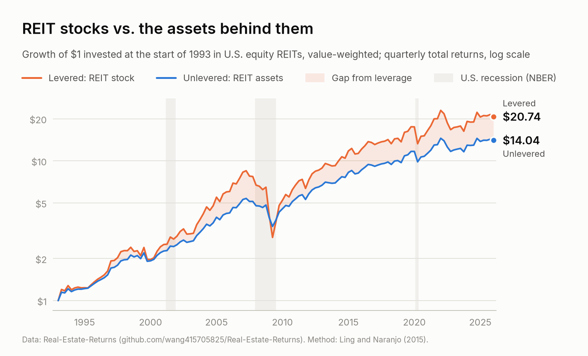
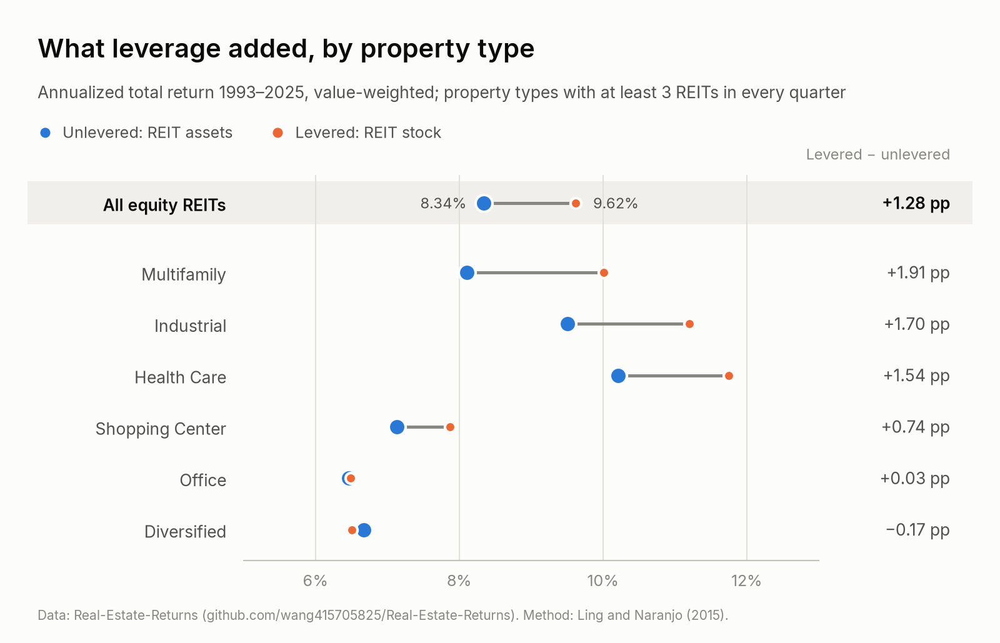
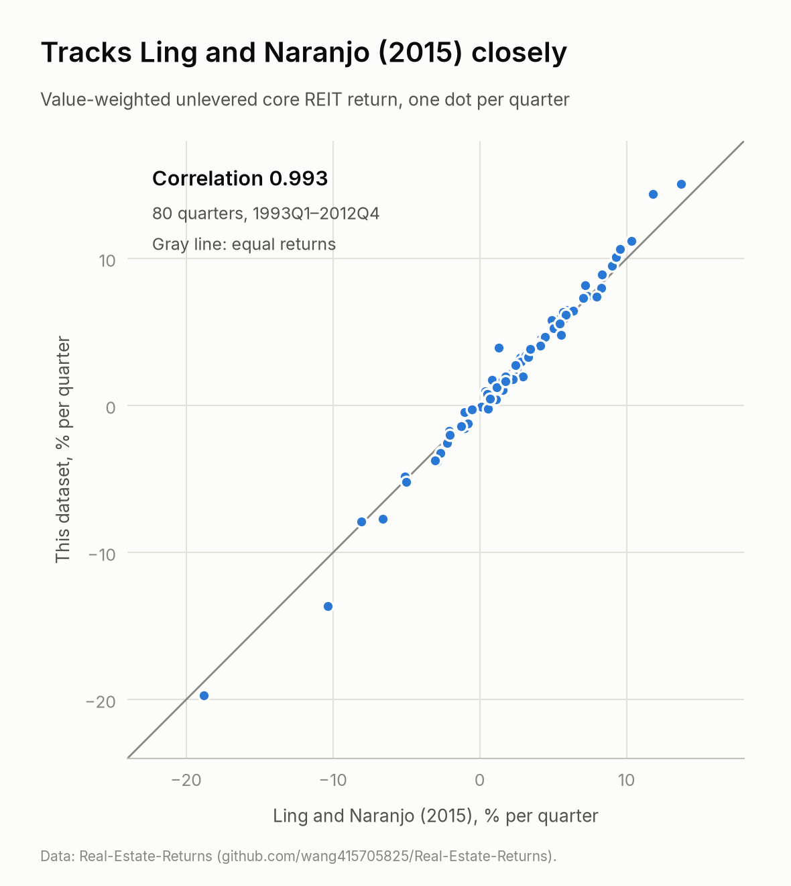

# Real Estate Returns

Quarterly **unlevered** (asset-level) and **levered** (equity) total-return indices for
U.S. equity REITs, **1993Q1–2025Q4**: all equity REITs, core and non-core property types,
and 14 individual property types, each value- and equal-weighted.

Unlevered returns remove the effect of financial leverage from REIT stock returns, so they
track the performance of the underlying property portfolios. The series follow the
de-levering method of Ling and Naranjo (2015), as used in Ling, Wang, and Zhou (2022,
*Real Estate Economics*).

<picture>
  <source media="(prefers-color-scheme: dark)" srcset="figures/cumulative_returns-dark.png">
  
</picture>

## Data

| File | Contents |
|---|---|
| [`data/reit_return_indices.csv`](data/reit_return_indices.csv) | All equity REITs, Core and Non-core: value- and equal-weighted, unlevered and levered returns, and REIT counts; one row per quarter |
| [`data/reit_returns_by_property_type.csv`](data/reit_returns_by_property_type.csv) | The same four series for each of 14 S&P Global property types; one row per type and quarter |
| [`data/REIT_Return_Indices.xlsx`](data/REIT_Return_Indices.xlsx) | Excel version of both files, with notes and summary statistics |
| [`data/summary_statistics.csv`](data/summary_statistics.csv) | Annualized returns and volatilities by group, weighting and period |
| [`legacy/2021-04/`](legacy/2021-04) | The previous release (1993Q1–2020Q4), unchanged |

Returns are nominal total returns in percent per calendar quarter. Column definitions are in
[`data/README.md`](data/README.md). To load the main file directly:

```python
import pandas as pd
url = "https://raw.githubusercontent.com/wang415705825/Real-Estate-Returns/main/data/reit_return_indices.csv"
df = pd.read_csv(url)
```

```stata
import delimited "https://raw.githubusercontent.com/wang415705825/Real-Estate-Returns/main/data/reit_return_indices.csv", clear
```

## Headline statistics

<!-- stats:start -->
| Series, 1993Q1–2025Q4 | Unlevered: return | Unlevered: volatility | Levered: return | Levered: volatility |
|---|---:|---:|---:|---:|
| All equity REITs, value-weighted | 8.34% | 11.17% | 9.62% | 19.00% |
| All equity REITs, equal-weighted | 8.87% | 9.49% | 10.85% | 20.01% |
| Core, value-weighted | 7.58% | 11.26% | 8.22%† | 20.26%† |
| Core, equal-weighted | 8.27% | 9.77% | 10.03% | 20.75% |
| Non-core, value-weighted | 8.95%† | 13.88%† | 9.81%† | 19.68%† |
| Non-core, equal-weighted | 9.61% | 9.64% | 11.63% | 19.89% |

Annualized geometric mean return and annualized volatility (quarterly standard deviation × 2), computed from the published CSV; more periods in [`data/summary_statistics.csv`](data/summary_statistics.csv).

† Computed over the available quarters: the 1993Q1 value of this series is not yet published (see [CHANGELOG.md](CHANGELOG.md)).
<!-- stats:end -->

<picture>
  <source media="(prefers-color-scheme: dark)" srcset="figures/property_type_returns-dark.png">
  
</picture>

## Method in brief

For REIT *i* in quarter *t*, the unlevered return is the capital-weighted average of the
returns on its equity, debt and preferred stock (Ling and Naranjo, 2015):

$$
r^{U}_{i,t} = \theta^{E}_{i,t-1}\, r^{E}_{i,t} + \theta^{D}_{i,t-1}\, r^{D}_{i,t} + \theta^{P}_{i,t-1}\, r^{P}_{i,t}
$$

- $r^{E}$ is the CRSP total stock return (monthly returns including delisting returns,
  compounded within the calendar quarter). It is also the **levered** return.
- $r^{D}$ is interest expense in quarter *t* divided by book debt at the end of quarter
  *t*−1; $r^{P}$ is preferred dividends divided by preferred equity at the end of *t*−1.
- The weights $\theta$ are the market value of equity, book debt and preferred equity as
  shares of their sum at the end of quarter *t*−1.

Index returns average across REITs each quarter, either equally or by equity market
capitalization at the end of the prior quarter.

- **Universe.** Equity REITs covered by S&P Global Market Intelligence with U.S. REIT
  status, matched to CRSP by CUSIP: 436 REITs and 20,289 REIT-quarters, with 96–183 REITs
  per quarter.
- **Groups.** *Core* = Office, Multifamily, Industrial, Shopping Center, Regional Mall and
  Other Retail REITs (the core property types of Ling and Naranjo, 2015); *Non-core* = all
  other property types. Property types follow S&P Global's classification of each REIT.
  Property-type cells with fewer than 3 REITs are left blank.

Sample construction, data fallbacks and limitations are documented in
[`docs/methodology.md`](docs/methodology.md).

## Validation

<picture>
  <source media="(prefers-color-scheme: dark)" srcset="figures/validation_ln2015-dark.png">
  
</picture>

| Benchmark | Quarters | Correlation | Annualized return (this dataset vs benchmark) |
|---|---:|---:|---|
| Ling and Naranjo (2015) unlevered core REIT index | 1993Q1–2012Q4 (80) | 0.993 | 9.62% vs 9.21% |
| FTSE Nareit All Equity REITs (levered) | 1993Q1–2025Q4 (132) | 0.986 | 9.62% vs 9.45% |

`python scripts/validate.py ln2015` reproduces the first comparison from this repository
alone; the second needs the FTSE Nareit monthly history from [reit.com](https://www.reit.com).
Property-type comparisons are in [`docs/methodology.md`](docs/methodology.md#5-validation).

## How to cite

If you use these series, please cite:

> Ling, D. C., Wang, C., and Zhou, T. (2022). Asset productivity, local information
> diffusion, and commercial real estate returns. *Real Estate Economics*, 50(1), 89–121.
> https://doi.org/10.1111/1540-6229.12354
>
> Ling, D. C., and Naranjo, A. (2015). Returns and information transmission dynamics in
> public and private real estate markets. *Real Estate Economics*, 43(1), 163–208.
> https://doi.org/10.1111/1540-6229.12069

A companion study using the refreshed series to compare public and private commercial real
estate returns is in progress; its citation will be added here.

```bibtex
@article{LingWangZhou2022,
  author  = {Ling, David C. and Wang, Chongyu and Zhou, Tingyu},
  title   = {Asset Productivity, Local Information Diffusion, and Commercial Real Estate Returns},
  journal = {Real Estate Economics},
  year    = {2022},
  volume  = {50},
  number  = {1},
  pages   = {89--121},
  doi     = {10.1111/1540-6229.12354}
}

@article{LingNaranjo2015,
  author  = {Ling, David C. and Naranjo, Andy},
  title   = {Returns and Information Transmission Dynamics in Public and Private Real Estate Markets},
  journal = {Real Estate Economics},
  year    = {2015},
  volume  = {43},
  number  = {1},
  pages   = {163--208},
  doi     = {10.1111/1540-6229.12069}
}
```

GitHub's **Cite this repository** button uses [`CITATION.cff`](CITATION.cff).

## Property portfolio return (PPR)

Ling, Wang, and Zhou (2022) also construct a REIT-level *property portfolio return* (PPR)
from proprietary NCREIF local-market returns and S&P Global property holdings. It cannot be
redistributed and is not included here; see the paper for how it is built.

## Reproducing the series

- [`scripts/`](scripts) works from the published CSVs only:
  `pip install -r requirements.txt`, then `python scripts/build_outputs.py` rebuilds the
  summary statistics, the Excel workbook, the figures and the table above, and
  `python scripts/check_data.py` runs the integrity checks.
- [`pipeline/`](pipeline) is the construction code, from vendor data to the CSVs. It needs
  your own access to S&P Global Market Intelligence and WRDS (CRSP, Compustat); see
  [`pipeline/README.md`](pipeline/README.md).

## Data sources and license

Compiled from CRSP (CIZ format) and Compustat, accessed through WRDS, and from S&P Global
Market Intelligence, retrieved in mid-2026. The repository contains only aggregate index
returns and statistics, no vendor data; the underlying data remain subject to their
providers' terms.

- Data and documentation: [CC BY-NC 4.0](LICENSE-DATA) (attribution, non-commercial use).
- Code: [MIT](LICENSE).

## Versions

- **2026-09** (current): 1993Q1–2025Q4, levered and unlevered, by property type; rebuilt
  from CRSP CIZ, Compustat and S&P Global. Three 1993Q1 value-weighted Core/Non-core values
  are still pending; see [`CHANGELOG.md`](CHANGELOG.md).
- **2021-04**: 1993Q1–2020Q4, unlevered only; in [`legacy/2021-04/`](legacy/2021-04)
  (originally at the repository root, see
  [commit 516ccc4](https://github.com/wang415705825/Real-Estate-Returns/tree/516ccc4837af8f5818967d21bed5664da430711b)).

Questions and corrections are welcome as
[GitHub issues](https://github.com/wang415705825/Real-Estate-Returns/issues).
